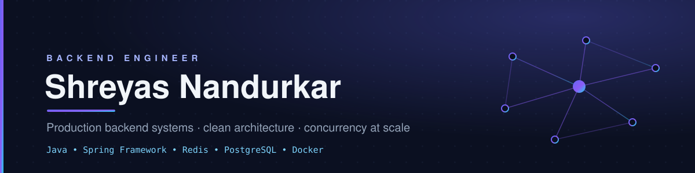

  

  &nbsp;
  &nbsp;
  &nbsp;
  &nbsp;
  

## About

Final-year Computer Science student at Manipal Institute of Technology, Bengaluru, focused on backend engineering with Java and Spring Boot. I build production systems end to end — a live URL-shortener product, an OpenAI-compatible LLM gateway, and a real-time image-streaming application — with an emphasis on clean architecture, concurrency, and performance. Co-founder and founding engineer at GoLinkGone.

## Featured Projects

### &nbsp;🔗&nbsp; GoLinkGone &nbsp;·&nbsp; live URL shortener & link-management platform

Co-founder and backend engineer. Short links, click analytics, and customizable QR code studio, serving real users. **27K+ pageviews in just ~1.5 Months · 500+ Sign-Ups · 550+ short links created · 22k+ redirects served.** Ranked #9 of 100+ products on Peerlist (Week 26); also launched on Product Hunt.

- **Customizable QR codes** — branded QR generation driven by a validated JSONB style configuration, persisted in custom storage and re-rendered on demand.
- **Analytics pipeline** — a 10K-capacity click queue drained every 3 seconds via map/reduce into batched upserts, with murmur3-hashed visitor IDs on a virtual-thread executor.
- **Platform** — Caffeine caching, ES256 JWT auth, Bucket4j rate limiting, MaxMind GeoLite2 geolocation, host-based dual-domain routing, Supabase auth with Google SSO.

  
  
  
  
  

&nbsp;

### &nbsp;♟️&nbsp; BotvinnikAPI &nbsp;·&nbsp; OpenAI-compatible LLM gateway

A single endpoint that routes, load-balances, and fails over across multiple LLM providers (Ollama, Gemini) while presenting the OpenAI wire protocol to clients, so standard SDKs and tools work unmodified.

- **Reactive core** — Spring WebFlux with R2DBC; SSE streaming with cross-provider chunk normalization.
- **Routing & resilience** — power-of-two-choices load balancing on live in-flight depth, TTFT-based provider health states, circuit breakers with connect-time failover.
- **Security** — SHA-256 gateway keys, AES-GCM-256 provider credentials, connect-time SSRF guard, per-key rate limits and spend caps.
- **Verified** — ~0.3 ms p50 gateway overhead, zero errors at 200 concurrent, 93 tests including failure injection.

  
  
  
  
  

### &nbsp;🎇&nbsp; Pixel Mosaic &nbsp;·&nbsp; real-time image reconstruction in the browser

Rebuilds the subject of one image using the pixels of another, streamed to a WebGL client and played back as an animated particle system.

- **AI subject extraction** — U²-Net saliency model served via ONNX Runtime.
- **Streaming** — custom binary WebSocket protocol (32-byte header + 256 KB chunks) feeding a Three.js instanced-points renderer with custom shaders.
- **Concurrency** — dual-lane processing pipeline with buffer pooling, a global concurrency semaphore, and per-IP rate limiting.
- Tried and loved by **100+** people.

  
  
  
  
  

&nbsp;

## Tech Stack

**Languages**

**Backend**

**Data**

**Infrastructure & Tools**

## Competitive Programming

Codeforces Expert · LeetCode Guardian (2142) · active on CodeChef and AtCoder.

- **1st place** — MAHE CodeWars 2026 &nbsp;(3rd place, 2025)
- **Top 5 Finalist** — Hitachi Visisonics AI'26
- Preparing for ICPC regionals

&nbsp;
&nbsp;
&nbsp;
&nbsp;

## GitHub Stats

  
  

  

